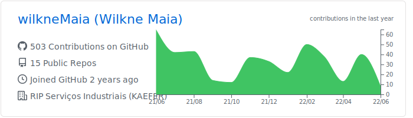

<!--  -->

<!-- ### Olá 👋 -->

<!-- ### Sou um Desenvolvedor de Software que mora no 🇧🇷 e trabalho na [RIP Serviços Industriais (KAEFER)](https://www.linkedin.com/company/ripservicosindustriais/). -->

<!--  -->
Hi, I'm Wilkne Maia

I work at [RIP Serviços Industriais (KAEFER)](https://www.linkedin.com/company/ripservicosindustriais/) for the SiProd Project.
I'm from Brazil and I live in Brazil.

#### Reach me on

  
  
  
  

<!-- ### Languages & Tools 🛠 -->
#### I mainly code using
&nbsp;
&nbsp;
&nbsp;
&nbsp;
&nbsp;

&nbsp;

&nbsp;
&nbsp;
&nbsp;
&nbsp;
&nbsp;

#### My toolbox includes
&nbsp;
&nbsp;

#### Analytics

<!-- 

  
  

   -->

<a href="https://github.com/wilkneMaia">
<!--    -->
  
  
</a>

<!--  -->

<!-- ### Vamos nos conectar ? 🤝 -->

<!-- 

  
  
  
  

 -->
