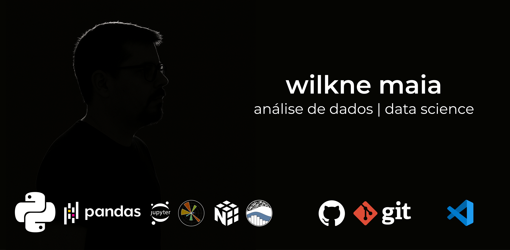

# 👋 Olá, eu sou o Wilkne Maia

🚀 Bem-vindo ao meu GitHub! Aqui reúno experimentos, soluções e estudos voltados principalmente para **Python** e **Análise de Dados**. Cada projeto é fruto de um desafio real ou de uma exploração de novas ferramentas.

---

## Sobre mim

- 🔭 Atualmente em busca de novas oportunidades na área de **Data Science** e **Análise de Dados**
- 🌱 Me especializando em **Machine Learning**, **Ciência de Dados** e **Visualização de Dados**
- 👯 Busco colaborar em projetos de **Open Source** focados em Data Science e estou ativamente procurando por oportunidades para contribuir.
- 🤔 Interesso-me por automação de processos, ETL e análise preditiva
- 📫 Como me encontrar:
  

    
    
    
    
  

---

## Tecnologias & Ferramentas

  
  
  
  
  
  
  
  
  
  

---

## Formação

  
📜 Certificados (Clique para expandir)

   
  <!-- Adicione aqui os links diretos para seus certificados, se disponíveis -->
  - Data Science with Python – Coursera <!-- ([Link para o certificado](URL_DO_CERTIFICADO)) -->
  - Python for Data Analysis – DataCamp <!-- ([Link para o certificado](URL_DO_CERTIFICADO)) -->
  - Introdução ao Machine Learning – Udemy <!-- ([Link para o certificado](URL_DO_CERTIFICADO)) -->
   

---

## Planejamento (Roadmap de Estudos)

  
🛣 Roadmap (Clique para expandir)

   
  - 🎯 Big Data (Spark, Hadoop) - *Em estudo*
  - 💡 Deep Learning (TensorFlow / PyTorch) - *Próximos passos*
  - 📚 MLOps (MLflow, DVC e CI/CD para modelos) - *Planejado*
   

---

## Principais Projetos

<!-- IMPORTANTE: Substitua os links SEU-REPO-* e adicione informações específicas de cada projeto. -->

  
<strong>1. Análise Exploratória de Vendas</strong> (Clique para expandir)

   
  **Objetivo:** <!-- Descreva o problema que este projeto resolve ou o que ele busca alcançar. Ex: Identificar padrões de consumo e otimizar estratégias de marketing. -->
  **Descrição:** Pipeline de ETL e EDA em Python para base de vendas de e-commerce.
  **Tecnologias:** Pandas, Matplotlib, Seaborn, Jupyter Notebook.
  **Resultados Chave:** <!-- Mencione algum resultado ou impacto do projeto. Ex: Identificação dos produtos mais vendidos por região. -->
  <!-- **Visualização:** (Opcional: Adicione um GIF ou screenshot do projeto) -->
  <!--  -->
   
  🔗 [Repositório do Projeto](https://github.com/wilkneMaia/SEU-REPO-EDA) <!-- ATUALIZE ESTE LINK -->
  <!-- 📊 [Relatório Interativo (se hospedado)](LINK_PARA_NOTEBOOK_RENDERIZADO) -->
   

  
<strong>2. Previsão de Demanda</strong> (Clique para expandir)

   
  **Objetivo:** <!-- Descreva o problema que este projeto resolve ou o que ele busca alcançar. Ex: Prever a demanda futura de um produto para otimizar o estoque. -->
  **Descrição:** Modelagem preditiva com regressão linear e Random Forest.
  **Tecnologias:** Scikit-Learn, GridSearchCV.
  **Métricas:** RMSE, MAE, R².
  **Resultados Chave:** <!-- Mencione algum resultado ou impacto do projeto. Ex: Redução de X% no erro de previsão. -->
  <!-- **Visualização:** (Opcional: Adicione um GIF ou screenshot do projeto) -->
   
  🔗 [Repositório do Projeto](https://github.com/wilkneMaia/SEU-REPO-DEMANDA) <!-- ATUALIZE ESTE LINK -->
   

  
<strong>3. Dashboard Streamlit para KPIs Financeiros</strong> (Clique para expandir)

   
  **Objetivo:** <!-- Descreva o problema que este projeto resolve ou o que ele busca alcançar. Ex: Fornecer uma visualização interativa dos principais indicadores financeiros. -->
  **Descrição:** Aplicação web para visualização de KPIs financeiros.
  **Tecnologias:** Streamlit, PostgreSQL.
  **Deploy:** Heroku (planejado ou realizado).
  **Resultados Chave:** <!-- Mencione algum resultado ou impacto do projeto. Ex: Facilitou a tomada de decisão da equipe financeira. -->
  <!-- **Visualização:** (Opcional: Adicione um GIF ou screenshot do projeto) -->
  <!--  -->
   
  🔗 [Repositório do Projeto](https://github.com/wilkneMaia/SEU-REPO-STREAMLIT) <!-- ATUALIZE ESTE LINK -->
  🚀 [Demonstração Online](LINK_PARA_APP_NO_HEROKU) <!-- ATUALIZE ESTE LINK SE JÁ ESTIVER ONLINE -->
   

---

## Qualidade de Código & Boas Práticas

Sou um entusiasta de código limpo, bem documentado e testado. Em meus projetos, busco aplicar princípios de desenvolvimento que garantam a manutenibilidade e escalabilidade das soluções. Tenho interesse e estou estudando a implementação de pipelines de CI/CD para automação de testes e integrações.

<!-- Se você tiver um projeto específico com CI/CD configurado, pode adicionar os badges aqui: -->
<!--

  
  

-->

---

## Demonstração Online de Projetos

Alguns dos meus projetos podem ser explorados interativamente:
- **Notebooks interativos:** via [Binder](https://mybinder.org) (quando aplicável e configurado nos repositórios).
- **Dashboards e Aplicações Web:** deploy no [Heroku](https://www.heroku.com) ou [Railway](https://railway.app).

<!-- Adicione links diretos para demonstrações, se disponíveis:
- [Nome do Projeto 1 - Dashboard Interativo](LINK_DA_DEMONSTRACAO_1)
- [Nome do Projeto 2 - Notebook no Binder](LINK_DA_DEMONSTRACAO_2)
-->

---

## Contribuições Open Source

Estou sempre em busca de oportunidades para contribuir com a comunidade de software livre, especialmente em projetos relacionados a Data Science, Python e Machine Learning. Minhas contribuições podem ser acompanhadas através das minhas atividades no GitHub (Pull Requests, Issues reportadas).

<!-- Se você já tiver contribuições específicas, liste-as aqui:
- Contribuí para o projeto [NomeDoProjetoOpenSource1](LINK_PARA_O_PROJETO) com [descrição da contribuição ou link para PR/Issue].
- Participei da discussão e solução da issue [NúmeroDaIssue] no repositório [NomeDoProjetoOpenSource2](LINK_PARA_A_ISSUE).
-->

---

## Estatísticas do GitHub

  
  

  
  

---
