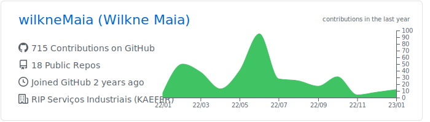

<!--  -->

<!-- ### Olá 👋 -->

<!-- ### Sou um Desenvolvedor de Software que mora no 🇧🇷 e trabalho na [RIP Serviços Industriais (KAEFER)](https://www.linkedin.com/company/ripservicosindustriais/). -->

<!--  -->
# 🎲 Hi, I'm Wilkne Maia

Greetings! Welcome to my GitHub repository. Here you will discover an assortment of solutions, experiments, and code snippets, primarily centered around the realm of technology, with a special focus on data-related endeavors.The projects I showcase here reflect my ongoing journey of learning and problem-solving. Each creation is a response to real-life challenges, and over time, they have evolved into valuable resources that I'm eager to share. I believe in the power of community, where sharing knowledge binds us together. My hope is that something you find here will prove useful in your own endeavors.Feel free to explore, share, comment, and provide feedback. Let's engage and build a thriving community together!
I'm from Brazil.

#### Reach me on

  
  
  
  

___
<!-- ### Languages & Tools 🛠 -->
<!--#### I mainly code using
&nbsp;
&nbsp;

&nbsp;
&nbsp;
&nbsp;

&nbsp;

&nbsp;
&nbsp;

&nbsp;
&nbsp;
&nbsp;

#### My toolbox includes
&nbsp;
&nbsp; -->

### 🧰 Programming Languages and Tools
    

 
    
#

  
<h3>📦 Main Repos</h3>

  

  

  

  

  
<h3>📊 GitHub Stats</h3>

  <h3>💻 Profile Stats and 🔥 Streak</h3>
  
  </a>  
  </a>
   

  <h3>💪 Contribution Graph (Last 30d)</h3>
  </a>
   
  
  <h3>🦾 Contribution Graph (Last Year)</h3>
  </a>
   

  
  

<!-- #### Analytics

<!-- 

  
  

   -->
   
<!--  

<a href="https://github.com/wilkneMaia">
  
<!--    -->
 <!--  
</a>

 -->

<!--  -->

<!-- ### Vamos nos conectar ? 🤝 -->

<!-- 

  
  
  
  

 -->
